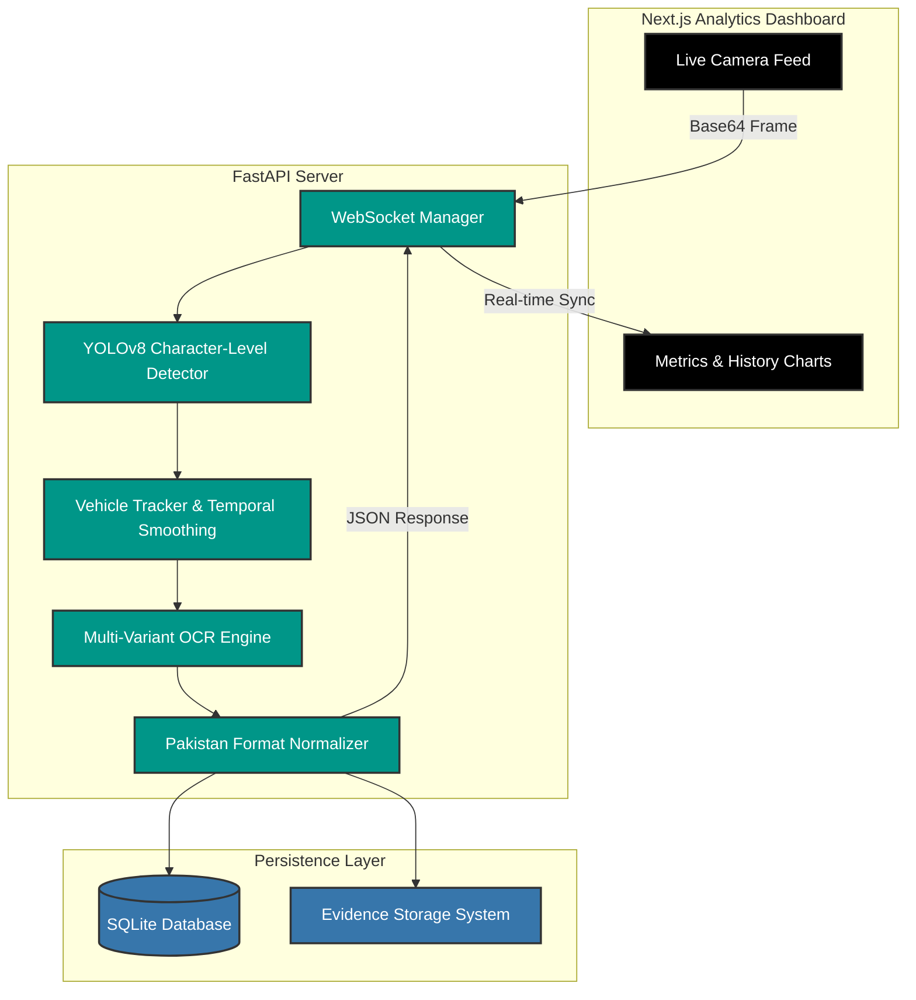
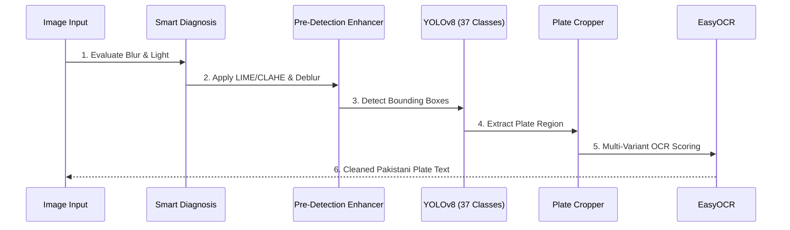
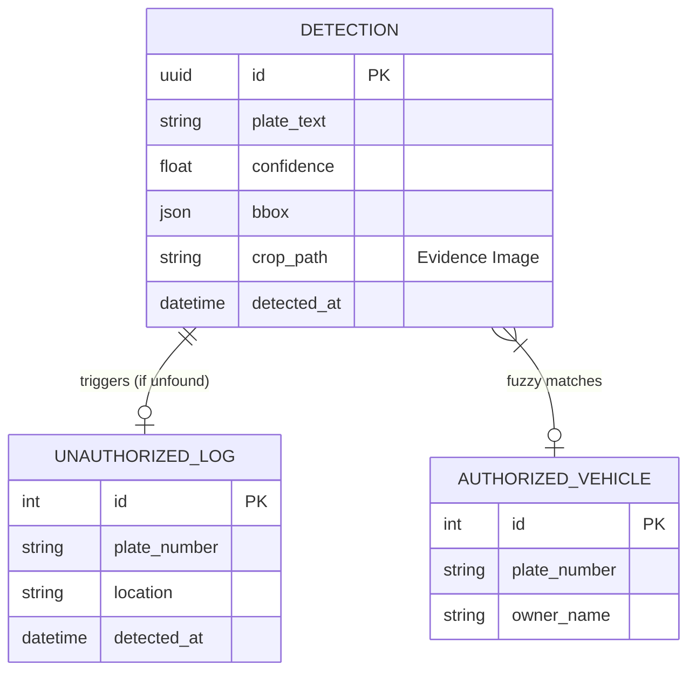

<div align="center">
  
  
  # 🚗 Pakistan ANPR System
  **Production-Grade Automatic Number Plate Recognition**
  
  *🎓 6th Semester Digital Image Processing (DIP) Project | Automated Monitoring & Enforcement*

  [](https://www.python.org/)
  [](https://fastapi.tiangolo.com/)
  [](https://nextjs.org/)
  [](https://ultralytics.com/)
  [](https://sqlite.org/)
</div>

<br />

> A comprehensive, highly-localized **Automatic Number Plate Recognition (ANPR)** system engineered specifically for the Pakistani context. This project fuses state-of-the-art Computer Vision (YOLOv8) and Deep Learning OCR (EasyOCR) to provide a robust, real-time vehicle monitoring solution backed by a beautiful full-stack dashboard.

---

## 🏛️ System Architecture

Our system follows a modular, service-oriented architecture designed for high throughput, strict security, and zero-latency video processing.



---

## 🔍 The ANPR Pipeline (Under the Hood)

We didn't just use a basic model; we built an entire image enhancement pipeline to ensure plates are readable even in terrible conditions (nighttime, motion blur, fog).



---

## ✨ Key Features & Localized Context

Unlike generic ANPR systems, this project is fine-tuned for the unique rules and aesthetics of Pakistani license plates:

*   🎯 **Character-Level YOLOv8 Model:** Our model detects 37 unique classes (A-Z, 0-9, and the plate boundary). By understanding characters rather than just a blurry rectangle, we ensure high precision in low lighting.
*   🇵🇰 **Universal Smart Card Support:** Built-in regex parsing for the latest Punjab/Sindh Universal Series (e.g., `AAA-123`, `AZ-123-456`) alongside legacy city codes (`LEA-1234`).
*   ⚖️ **Temporal Smoothing (Stability Fix):** Built a custom `VehicleTracker` that uses a majority-voting algorithm over a 7-frame window. This ensures the "Live" text feed remains rock-solid and flicker-free, even on fast-moving cars.
*   📸 **Cryptographic Evidence Storage:** Automatically saves high-resolution crops of every detected plate in `uploads/evidence/` for legal verification.
*   🚀 **Graceful Degradation:** Smart CPU/GPU detection limits aggressive enhancements on live video streams to maintain high FPS while employing maximum AI power on static image uploads.

---

## 💾 Database Schema (Entity Relationship)



---

## 📈 Analytics & Academic Evaluation

The system includes a dedicated **Evaluation Service** designed to prove algorithmic efficiency for academic grading:

- **mAP (Mean Average Precision):** Evaluated against the Roboflow ANPR dataset.
- **F1-Score Proxy:** Uses high-confidence reads vs low-confidence reads to estimate real-world Precision/Recall.
- **Throughput:** Real-time FPS monitoring and per-stage latency tracking (Diagnosis -> Lighting -> Deblur -> Detection -> OCR).

---

## 🚀 Quick Start Guide

### 1. Prerequisites
- **Python 3.13** (Windows/Linux/Mac)
- **Node.js 20+**
- **Git**

### 2. Installation
```bash
# Clone the repository
git clone https://github.com/rayyan123571/Automated-Number-plate-Recognition.git
cd Automated-Number-plate-Recognition

# Backend Setup
cd backend
python -m venv .venv
# Activate (Windows)
.\.venv\Scripts\activate
# Activate (Linux/Mac)
source .venv/bin/activate
pip install -r requirements.txt

# Frontend Setup
cd ../frontend
npm install
```

### 3. Execution
- **Run Backend:** `start_backend.bat` (API on Port 8000)
- **Run Frontend:** `start_frontend.bat` (Dashboard on Port 3000)

---

## 🛠️ Engineering Standards

- **Backend:** Clean Architecture with Dependency Injection (FastAPI).
- **Frontend:** Glassmorphism UI using Tailwind CSS v4 and Framer Motion.
- **State Management:** TanStack Query for high-performance WebSocket data syncing.
- **Database:** SQLite with SQLAlchemy 2.x for lightweight but powerful persistence.

---

## 👥 Meet the Developers

This project was architected, trained, and developed by:

*   💻 **[@DanishButt586](https://github.com/DanishButt586)** — Full-Stack Integration & System Architecture
*   🧠 **[@rayyan123571](https://github.com/rayyan123571)** — Computer Vision, YOLOv8 Training, & OCR Optimization

*For any inquiries regarding the dataset, model weights, or system architecture, please reach out via GitHub issues.*

---

## 📄 License & Academic Integrity
This project is for academic purposes as part of the 6th Semester Digital Image Processing (DIP) curriculum. Distributed under the MIT License.
